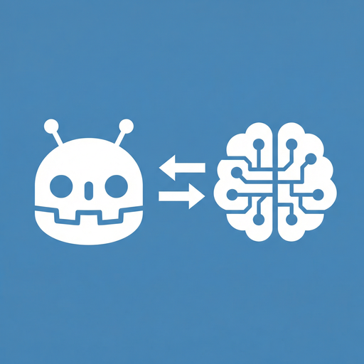
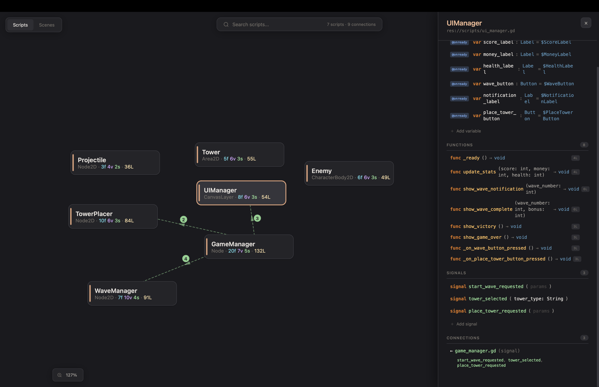

<div align="center">



# godot-mcp-bridge

**Give your AI assistant full access to the Godot editor.**

[](./LICENSE)
[](https://godotengine.org)
[](#what-can-it-do)
[](https://github.com/TomasLucasUTN/godot-mcp-bridge/commits/main)
[](https://github.com/TomasLucasUTN/godot-mcp-bridge/stargazers)

</div>

Build games faster with Claude, Cursor, or any MCP-compatible AI — no copy-pasting, no context switching. AI reads, writes, and manipulates your scenes, scripts, nodes, and project settings directly.

Started as a fork of [tomyud1/godot-mcp](https://github.com/tomyud1/godot-mcp) (MIT
licensed) and has since diverged substantially — see [`CHANGELOG.md`](./CHANGELOG.md).

---

## Why this one

Most Godot MCP servers edit your `.tscn` files on disk. If you have that scene **open
in the editor with unsaved changes, they silently overwrite your work.** This one
doesn't: when a scene is open, every mutating tool edits the **live editor tree**
instead — so your unsaved edits survive, and structural changes go through Godot's
**undo system** (Ctrl+Z works). You can keep working in the editor while the AI works
alongside you. Closed scenes still edit on disk as usual.

A few more things that set it apart:

- **Works alongside you** — the AI can poll `get_editor_activity` to see what *you* just
  did in the editor (selection, scene open/close/save, script focus, resource saves,
  asset reimports, settings changes, undo/redo, which screen you're on), tagged human vs
  its own actions. True pair-programming, not one-directional. No other Godot MCP has this.
- **Real headless export** — builds an actual game binary via a shadow-workspace clone,
  asynchronously, without freezing the editor (`export_project` → `get_export_status`).
- **Runs your real tests** — `run_gut_tests` executes your GUT unit suite (sync or async)
  and reports pass/fail, so the AI acts on real results instead of guessing.
- **Drives the running game** — call methods, set properties, `await` signals, `game_eval`
  a snippet, record/replay input, snapshot the live tree, even a multiplayer peer-spawn
  harness (`spawn_headless_peers`) — deterministic playtesting without screenshots.
- **Sandboxed paths** — every path is guarded against traversal outside the project
  (the class of bug behind CVE-2026-15522 in another server).
- **Writes the boilerplate for you** — `wire_signal` connects a signal *and* generates
  the correctly-typed handler; `generate_onready_refs` emits typed `@onready` vars for a
  subtree; `scaffold_entity` builds a character (body + collision shape resource + sprite
  + movement script) in one call; `scaffold_state_machine` lays out a working FSM.
  Physics layers can be set **by name** instead of bit indices.
- **Tells you what's rotting** — `find_unused_resources`, `detect_circular_dependencies`,
  `analyze_scene_complexity`, and `analyze_signal_flow` (which catches connections whose
  handler doesn't exist — a bug that otherwise only shows up at runtime).
- **Visual regression** — `compare_screenshots` diffs two frames and reports the changed
  percentage and region, so "did my change actually alter the screen?" has an answer.
- **Tests your UI like a human would** — click a button by its visible caption
  (`click_control_runtime({text: "Start"})`, which refuses and lists candidates if the
  text is ambiguous), then assert what's on screen with `assert_screen_text` — reading the
  live Control tree, so it works headless with no OCR.
- **Localization that doesn't half-work** — `sync_localization` registers the
  `.translation` files Godot generated from your CSV (the manual step that silently makes
  a language never load) and reports every key you haven't translated yet, per locale.
- **Setup that explains itself** — `npx godot-mcp-bridge install` installs and enables the
  addon in one command; `doctor` diagnoses a broken setup; `diagnose_connection` tells the
  AI exactly why the editor isn't connecting.
- **Fast + robust** — `batch_execute` / `batch_scene_edit` cut N calls to one; heavy reads
  (`read_scene`, `scene_tree_dump`, `classdb_query`) take `max_depth`/`filter` to stay
  token-cheap; only 35 tools load by default so the agent stays focused.
- **C# too** — `create_csharp_script` scaffolds the Godot C# boilerplate.
- **Pre-flight validation** — `validate_scripts` sweeps every `.gd`; `validate_scene_integrity`
  flags nodes left with an empty required resource; `validate_meshes` catches empty geometry.

---

## How it compares

Checked against each project's own README and tool list as of July 2026 — not just
star count, which tracks age and discoverability more than feature depth.

| | **godot-mcp-bridge** (this repo) | [tomyud1/godot-mcp](https://github.com/tomyud1/godot-mcp) (fork origin) | [Coding-Solo/godot-mcp](https://github.com/Coding-Solo/godot-mcp) (most-starred) |
|---|---|---|---|
| Tools | 185 (35 loaded by default) | 42 | ~14 |
| Live-tree editing + undo | ✅ | ❌ (overwrites open scenes on disk) | ❌ |
| Drives the running game (input, screenshots, `game_eval`) | ✅ | ❌ | ❌ |
| Sees what *you* just did (`get_editor_activity`) | ✅ | ❌ | ❌ |
| Runs your real test suite (GUT) | ✅ | ❌ | ❌ |
| Async headless export | ✅ | ❌ | ❌ |
| Path-traversal sandboxing | ✅ | — | — |
| GitHub stars | — | 397 | 4.9k |

---

## Quick Start

### 0. Install Node.js (one-time setup)

Download and run the installer from **[nodejs.org](https://nodejs.org/en/download)** (LTS version). It's a standard installer — no terminal needed.

### 1. Install the Godot plugin

**One command, from inside your Godot project folder:**

```bash
npx godot-mcp-bridge install
```

That copies the addon into `addons/godot_mcp/` and enables the plugin in
`project.godot` (backing the file up first, and keeping every other plugin and
setting intact). Add `--client claude-desktop` or `--client cursor` and it will
register the server in that client's config too.

Something not connecting? Run this and it tells you which step is missing:

```bash
npx godot-mcp-bridge doctor
```

<details>
<summary>Prefer to do it by hand</summary>

Copy the `addons/godot_mcp/` folder from this repo into your Godot project's
`addons/` directory. Then go to **Project → Project Settings → Plugins** and
enable the **Godot MCP** plugin.

(The "Godot AI Assistant tools MCP" AssetLib listing belongs to the upstream
project this repo forked from, not this one — installing from there gets you
the upstream addon, not this fork.)
</details>

### 2. Add the server config to your AI client

**Claude Desktop** — Settings → Developer → Edit Config → open the config file and paste:

Mac / Linux:
```json
{
  "mcpServers": {
    "godot": {
      "command": "npx",
      "args": ["-y", "godot-mcp-bridge"]
    }
  }
}
```

Windows:
```json
{
  "mcpServers": {
    "godot": {
      "command": "cmd",
      "args": ["/c", "npx", "-y", "godot-mcp-bridge"]
    }
  }
}
```

**Cursor** — Settings → MCP → Add Server:

Mac / Linux:
```json
{
  "mcpServers": {
    "godot": {
      "command": "npx",
      "args": ["-y", "godot-mcp-bridge"]
    }
  }
}
```

Windows:
```json
{
  "mcpServers": {
    "godot": {
      "command": "cmd",
      "args": ["/c", "npx", "-y", "godot-mcp-bridge"]
    }
  }
}
```

**Claude Code** — run in terminal:
```bash
claude mcp add godot -- npx -y godot-mcp-bridge
```

Works with any MCP-compatible client (Cline, Windsurf, etc.)

### 3. Restart your AI client

Close and reopen Claude Desktop / Cursor / your client so it picks up the new config.

### 4. Restart your Godot project

Hit **Restart Project** in the Godot editor. Check the **top-right corner** — you should see **MCP Connected** in green. You're ready to go.

---

## What Can It Do?

### 185 Tools, 35 Loaded by Default

A big always-on tool list makes an AI agent wander between unrelated
capabilities and burns context on definitions it never uses. So only **`core`
(35 tools)** is visible by default — the smallest set that carries a normal
session end to end: look around, edit scenes and scripts, run the game, read the
errors.

Everything else is grouped **by intent** and is one call away:
`enable_toolset({ name: "runtime" })`. `list_toolsets` shows every set, what it's
for, and the names of the tools inside it — so the AI can find what it needs
without loading the whole catalog first. Nothing is ever unreachable.

For a goal-to-tool index and per-topic usage guides (scene editing patterns,
the runtime testing loop, asset generation, troubleshooting), see
[`docs/TOOLS.md`](./docs/TOOLS.md) — the same content the server exposes live
via the `get_guide` tool, in browsable form.

| Toolset | Tools | What it's for |
|---------|-------|---------|
| **core** *(always on)* | 35 | Look around (`read_scene`, `scene_tree_dump`, `search_project`, `classdb_query`), edit scenes/nodes (live-tree + undo, `batch_scene_edit`), scripts, run the game, read errors |
| **runtime** | 25 | Drive the running game: input (keyboard/mouse/**gamepad/touch**), `game_eval`, live node/property access, `await_signal_runtime`, UI-by-text clicking + `assert_screen_text`, input record/replay, multiplayer + `spawn_headless_peers` |
| **scene_editing** | 14 | Deeper scene work: collision shapes, sprites/meshes/materials, groups, anchors, spatial queries |
| **project_config** | 13 | Project settings, input map, autoloads, resources, `sync_localization` |
| **animation** | 12 | AnimationPlayer tracks/keyframes, AnimationTree state machines |
| **editor** | 11 | The editor itself: `get_editor_activity` (what *you* just did), selection, scene tabs, performance |
| **physics** | 7 | Collision shapes, raycasts, layers **by name**, collision presets |
| **tilemap** | 8 | TileMapLayer cell painting, terrain + deterministic bitwise autotiling |
| **analysis** | 6 | `find_unused_resources`, `detect_circular_dependencies`, `analyze_scene_complexity`, `analyze_signal_flow`, `get_project_statistics`, `compare_screenshots` |
| **scaffolding** | 6 | `wire_signal`, `generate_onready_refs`, `scaffold_entity`, `scaffold_state_machine`, `create_csharp_script` |
| **testing** | 6 | GUT test runner (sync/async), scene/mesh integrity validation, assertions |
| **ui** | 6 | Theme resources, colors, stylebox overrides |
| **3d** | 6 | Mesh instances, lighting presets, materials, environment, cameras, gridmaps |
| **shaders** | 6 | Create/read/edit GDShader, assign materials, set params |
| **navigation** | 5 | NavigationRegion setup, mesh baking, agents, layers |
| **vfx** | 5 | GPUParticles2D/3D, gradients, presets |
| **refactor** | 5 | Project-wide symbol rename, bulk property edits, file moves |
| **export** | 4 | Export presets and async export jobs |
| **audio** | 3 | AudioStreamPlayer variants, buses |
| **utility** | 2 | 2D asset generation, project/scene visualizer |

### Interactive Visualizer

Run `map_project` and get a browser-based explorer at `localhost:6510`:
- Force-directed graph of all scripts and their relationships
- Click any script to see variables, functions, signals, and connections
- Edit code directly in the visualizer — changes sync to Godot in real time
- Scene view with node property editing
- Find usages before refactoring



---

## Architecture

```
┌─────────────┐    MCP (stdio)   ┌──────────────┐   WebSocket   ┌──────────────┐
│  AI Client  │◄────────────────►│  MCP Server  │◄─────────────►│ Godot Editor │
│  (Claude,   │                  │  (Node.js)   │   port 6505   │  (Plugin)    │
│   Cursor)   │                  │              │               │              │
└─────────────┘                  │  Visualizer  │               │  185 tool    │
                                 │  HTTP :6510  │               │  handlers    │
                                 └──────┬───────┘               └──────────────┘
                                        │
                                 ┌──────▼───────┐
                                 │   Browser    │
                                 │  Visualizer  │
                                 └──────────────┘
```

---

## Limitations

- **Local only** — runs on localhost, no remote connections
- **Single connection** — one Godot instance at a time
- **Undo covers structural scene edits** — when a scene is open, add/remove/rename/move/duplicate go through Godot's undo history; other writes save directly (use version control), and some destructive tools support `dry_run: true` to preview first
- **AI is still limited in Godot knowledge** — it struggles with complex UI layouts, compositing scenes, and some node property manipulation; it can't create 100% of a game alone, but it can help debug, write scripts, and tag along for the journey. Still in active development — feedback is welcome.

---

## Development

To build from source instead of using npm:

```bash
cd mcp-server
npm install
npm run build
```

Then point your AI client at `mcp-server/dist/index.js` instead of using `npx`.

---

## Release notes

Narrative write-ups of each release live in [`release-notes/`](./release-notes/) (starting with [v1.0.0](./release-notes/v1.0.0.md)). For the full change history, see [`CHANGELOG.md`](./CHANGELOG.md).

---

## License

MIT

---

**[Report Issues](https://github.com/TomasLucasUTN/godot-mcp-bridge/issues)**
